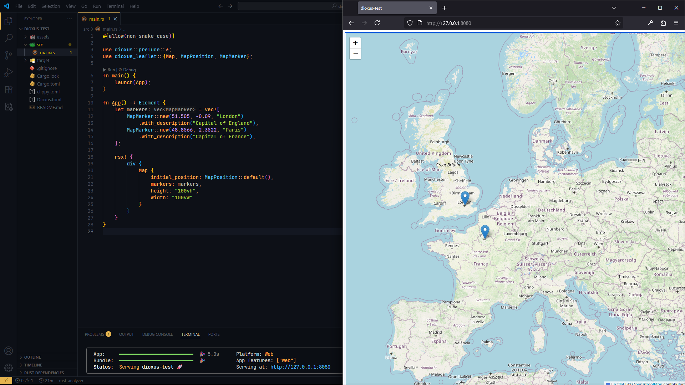
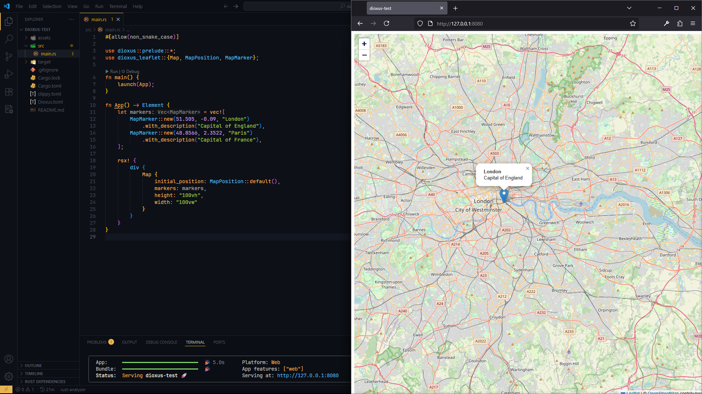

# Dioxus Leaflet

[](LICENSE-MIT)
[](LICENSE-APACHE)
[](https://crates.io/crates/dioxus-leaflet)
[](https://docs.rs/dioxus-leaflet)

A general-purpose [Leaflet](https://leafletjs.com/) map component for [Dioxus](https://dioxuslabs.com/) applications. This crate provides an easy-to-use, reactive map component that integrates seamlessly with Dioxus applications.

## Features

- **Easy-to-use map component** with customizable markers
- **Interactive markers** with popups and custom styling
- **Extensible marker system** with custom icons and data
- **CDN-based Leaflet integration** - no additional setup required
- **Responsive design** with customizable dimensions
- **Customizable tile layers** including OpenStreetMap and satellite imagery
- **Configurable map options** for zoom, dragging, and interaction controls
- **Event handling** for map clicks, marker clicks, and map movements

## Screenshots





## Installation

Add this to your `Cargo.toml`:

```toml
[dependencies]
dioxus-leaflet = "0.1.4"
dioxus = "0.6.3"
```

## Quick Start

Here's a simple example to get you started:

```rust
use dioxus::prelude::*;
use dioxus_leaflet::{Map, MapPosition, MapMarker};

fn App() -> Element {
    let markers = vec![
        MapMarker::new(51.505, -0.09, "London")
            .with_description("Capital of England"),
        MapMarker::new(48.8566, 2.3522, "Paris")
            .with_description("Capital of France"),
    ];

    rsx! {
        Map {
            initial_position: MapPosition::new(51.505, -0.09, 5.0),
            markers: markers,
            height: "500px",
            width: "100%"
        }
    }
}

fn main() {
    dioxus::launch(App);
}
```

## Core Components

### Map Component

The main `Map` component provides a full-featured Leaflet map:

```rust
rsx! {
    Map {
        initial_position: MapPosition::new(51.505, -0.09, 13.0),
        markers: markers,
        height: "400px",
        width: "100%",
        class: "my-custom-map",
        style: "border: 1px solid #ccc;",
        on_marker_click: move |marker| {
            println!("Marker clicked: {}", marker.title);
        },
        on_map_click: move |position| {
            println!("Map clicked at: {}, {}", position.lat, position.lng);
        }
    }
}
```

### Map Properties

| Property | Type | Default | Description |
|----------|------|---------|-------------|
| `initial_position` | `MapPosition` | London coordinates | Initial map center and zoom |
| `markers` | `Vec<MapMarker>` | Empty | Markers to display on the map |
| `height` | `String` | `"500px"` | Height of the map container |
| `width` | `String` | `"100%"` | Width of the map container |
| `options` | `MapOptions` | Default | Map configuration options |
| `class` | `String` | `""` | Additional CSS classes |
| `style` | `String` | `""` | Additional CSS styles |
| `on_marker_click` | `EventHandler<MapMarker>` | None | Callback when marker is clicked |
| `on_map_click` | `EventHandler<MapPosition>` | None | Callback when map is clicked |
| `on_map_move` | `EventHandler<MapPosition>` | None | Callback when map is moved |

## Working with Markers

### Basic Markers

```rust
let marker = MapMarker::new(51.505, -0.09, "London");
```

### Advanced Markers

```rust
let marker = MapMarker::new(51.505, -0.09, "London")
    .with_description("The capital city of England")
    .with_custom_data("country", "UK")
    .with_custom_data("population", "8900000")
    .with_popup_options(PopupOptions {
        max_width: Some(250),
        close_button: Some(true),
        auto_close: Some(false),
        ..Default::default()
    });
```

### Custom Marker Icons

```rust
use dioxus_leaflet::MarkerIcon;

let custom_icon = MarkerIcon::new("https://example.com/custom-icon.png")
    .with_size(32, 32)
    .with_anchor(16, 32);

let marker = MapMarker::new(51.505, -0.09, "Custom Marker")
    .with_icon(custom_icon);
```

## Map Configuration

### Map Options

Customize map behavior with `MapOptions`. Options will use sensible defaults if not specified:

```rust
use dioxus_leaflet::{MapOptions, TileLayer};

// Full configuration with all options specified
let options = MapOptions {
    zoom_control: Some(true),
    scroll_wheel_zoom: Some(true),
    double_click_zoom: Some(false),
    touch_zoom: Some(true),
    dragging: Some(true),
    keyboard: Some(true),
    attribution_control: Some(true),
    tile_layer: Some(TileLayer::satellite()), // Use satellite imagery
};

// Minimal configuration - specify only what you want to customize
let minimal_options = MapOptions {
    double_click_zoom: Some(false),
    tile_layer: Some(TileLayer::satellite()),
    ..MapOptions::new() // All other options will be None (use defaults)
};

// Use default configuration
let default_options = MapOptions::default(); // All options set to sensible defaults

rsx! {
    Map {
        options: options,
        // ... other props
    }
}
```

### Available Map Options

| Option | Type | Default | Description |
|--------|------|---------|-------------|
| `zoom_control` | `Option<bool>` | `true` | Show/hide zoom control buttons |
| `scroll_wheel_zoom` | `Option<bool>` | `true` | Enable/disable scroll wheel zooming |
| `double_click_zoom` | `Option<bool>` | `true` | Enable/disable double-click zooming |
| `touch_zoom` | `Option<bool>` | `true` | Enable/disable touch/pinch zooming |
| `dragging` | `Option<bool>` | `true` | Enable/disable map dragging |
| `keyboard` | `Option<bool>` | `true` | Enable/disable keyboard navigation |
| `attribution_control` | `Option<bool>` | `true` | Show/hide attribution control |
| `tile_layer` | `Option<TileLayer>` | OpenStreetMap | Tile layer configuration |

### Tile Layers

Choose from different tile layer providers:

```rust
use dioxus_leaflet::TileLayer;

// OpenStreetMap (default)
let osm_tiles = TileLayer::openstreetmap();

// Satellite imagery
let satellite_tiles = TileLayer::satellite();

// Custom tile layer
let custom_tiles = TileLayer {
    url: "https://{s}.tile.custom-provider.com/{z}/{x}/{y}.png".to_string(),
    attribution: "&copy; Custom Provider".to_string(),
    max_zoom: 18,
    subdomains: vec!["a".to_string(), "b".to_string()],
};
```

## Event Handling

Handle various map and marker events:

```rust
fn App() -> Element {
    let mut selected_marker = use_signal(|| None::<MapMarker>);
    let mut map_center = use_signal(|| MapPosition::default());

    rsx! {
        Map {
            on_marker_click: move |marker| {
                selected_marker.set(Some(marker));
            },
            on_map_click: move |position| {
                println!("Clicked at: {}, {}", position.lat, position.lng);
            },
            on_map_move: move |position| {
                map_center.set(position);
            },
            // ... other props
        }
        
        // Display selected marker info
        if let Some(marker) = selected_marker.read().as_ref() {
            div {
                "Selected: {marker.title}"
                if let Some(desc) = &marker.description {
                    p { "{desc}" }
                }
            }
        }
    }
}
```

## Styling

### CSS Classes

The component uses these CSS classes that you can style:

- `.dioxus-leaflet-container` - Main container
- `.dioxus-leaflet-map` - Map element

### Custom Styling

```css
.dioxus-leaflet-container {
    border-radius: 8px;
    box-shadow: 0 2px 10px rgba(0, 0, 0, 0.1);
}

.my-custom-map {
    border: 2px solid #007cba;
}
```

## Examples

### Tourist Map

```rust
use dioxus::prelude::*;
use dioxus_leaflet::{Map, MapPosition, MapMarker, PopupOptions};

fn TouristMap() -> Element {
    let attractions = vec![
        MapMarker::new(51.5074, -0.1278, "Big Ben")
            .with_description("Famous clock tower in London")
            .with_popup_options(PopupOptions {
                max_width: Some(200),
                ..Default::default()
            }),
        MapMarker::new(51.5033, -0.1195, "London Eye")
            .with_description("Giant Ferris wheel on the Thames"),
        MapMarker::new(51.5194, -0.1270, "British Museum")
            .with_description("World-famous museum with artifacts from around the globe"),
    ];

    rsx! {
        div { class: "tourist-map-container",
            h1 { "London Attractions" }
            Map {
                initial_position: MapPosition::new(51.5074, -0.1278, 12.0),
                markers: attractions,
                height: "100vh",
                width: "100vw",
                class: "attraction-map"
            }
        }
    }
}
```

### Real-time Location Tracking

```rust
fn LocationTracker() -> Element {
    let mut current_position = use_signal(|| MapPosition::default());
    let mut path_markers = use_signal(|| Vec::<MapMarker>::new());

    // Simulate location updates
    use_future(move || async move {
        loop {
            tokio::time::sleep(tokio::time::Duration::from_secs(5)).await;
            let new_pos = MapPosition::new(
                current_position.read().lat + (fastrand::f64() - 0.5) * 0.01,
                current_position.read().lng + (fastrand::f64() - 0.5) * 0.01,
                current_position.read().zoom,
            );
            current_position.set(new_pos.clone());
            
            let marker = MapMarker::new(new_pos.lat, new_pos.lng, "Current Location");
            path_markers.with_mut(|markers| markers.push(marker));
        }
    });

    rsx! {
        Map {
            initial_position: current_position.read().clone(),
            markers: path_markers.read().clone(),
            height: "500px",
            on_map_click: move |pos| {
                current_position.set(pos);
            }
        }
    }
}
```

## Contributing

Contributions are welcome! Please feel free to submit a Pull Request. For major changes, please open an issue first to discuss what you would like to change.

## License

This project is licensed under either of:

- Apache License, Version 2.0 ([LICENSE-APACHE](LICENSE-APACHE) or [Apache 2.0](http://www.apache.org/licenses/LICENSE-2.0))
- MIT License ([LICENSE-MIT](LICENSE-MIT) or [MIT](http://opensource.org/licenses/MIT))

at your option.

## Acknowledgments

- [Leaflet](https://leafletjs.com/) - The amazing mapping library this component wraps
- [Dioxus](https://dioxuslabs.com/) - The reactive UI library for Rust
- [OpenStreetMap](https://www.openstreetmap.org/) - Free geographic data used in examples

---

**Note**: This crate requires an internet connection to load Leaflet CSS and JavaScript from CDN. If you need offline support, consider hosting the Leaflet files locally and modifying the component accordingly.
